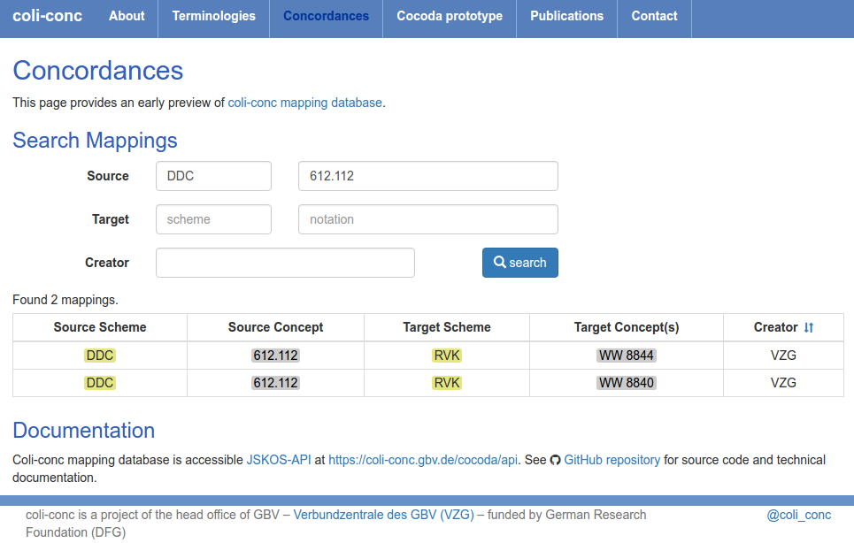

---
title: Describing Knowledge Organization Systems in BARTOC and JSKOS
shorttitle: Describing KOS in BARTOC & JSKOS
author: Andreas Ledl, Jakob Voß, Uma Balakrishnan
date: 2016-06-23
place: TKE 2016, Copenhagen
...

# Project coli-conc

# System overview 

\fontsize{9pt}{10.8}\selectfont

\begin{tikzpicture}
\tikzstyle{box}=[align=center,draw,shape=rectangle,thick]
%\tikzstyle{arrow}=[->[scale=1.5],thick]

\node[box] (db) {Database \&\\Web Service};
\node[box,left=14mm of db.west] (jskos) {\textbf{JSKOS}};
\draw[->] (jskos) to node[above] {import} (db);
\matrix (m) [matrix of nodes,column 1/.style={anchor=base east},left=1cm of jskos.west] {
  GND \\
  RVK \\
  DDC \\
  Geonames \\
  BARTOC \\
  Mappings \\
  SKOS/RDF \\
  ... \\
};

\node[above left=6mm of jskos,anchor=west] {convert};
\draw[->,out=0,in=180] 
    (m-1-1) to (jskos)
    (m-2-1) to (jskos)
    (m-3-1) to (jskos)
    (m-4-1) to (jskos)
    (m-5-1) to (jskos)
    (m-6-1) to (jskos)
    (m-7-1) to (jskos)
    (m-8-1) to (jskos); 

\matrix (apps) [column 1/.style={anchor=base west},right=12mm of db.east,row sep=2mm] {
  \node {applications}; \\
  \node[box] (app1) {terminology\\browsing}; \\
  \node[box] (app2) {terminology\\register}; \\
  \node[box] (app3) {mapping\\query}; \\
  \node[box] (app4) {synonym\\service}; \\
  \node[box] (app5) {...}; \\
};

\draw[->,out=0,in=180] (db) to (app1);
\draw[->,out=0,in=180] (db) to (app2);
\draw[->,out=0,in=180] (db) to (app3);
\draw[->,out=0,in=180] (db) to (app4);
\draw[->,out=0,in=180] (db) to (app5);

\node[above right=6mm and 7mm of db,anchor=east] {JSKOS-API};

\matrix (e) [matrix of nodes,column 1/.style={anchor=base west},below=15mm of db,anchor=west] {
  JSKOS \\
  RDF \\
};
\draw[->,out=-90,in=180] (db) to node[anchor=east] {export} (e-1-1);
\draw[->,out=-90,in=180] (db) to (e-2-1);

\end{tikzpicture}

# JSKOS data format

Requirement: uniform access to KOS data

* based on RDF (SKOS & Dublin Core)\
  \ldots but more restrictive (unification)
* based on JSON-LD\
  \ldots extended by language ranges and closed world statements

main goal: **easy use of KOS data in web applications**

Specified at <https://gbv.github.io/jskos/>

# JSKOS beyond JSON-LD: closed world statements

narrower concepts may exist (open world assumption)

* `{ }`{.json}
  
$\exists$: narrower concepts exist (but not included here)
    
* `{ "narrower": [ null ] }`{.json}

$\nexists$: no narrower concepts exist

* `{ "narrower": [] }`{.json}

language ranges state that more labels in other languages exist

* `{"en": "english label", "-": "..." }`{.json}

# JSKOS beyond SKOS: data and object types

data types      | object types
----------------|-------------
URI             | Concept
URL             | Concept Type
date            | Concept Scheme
list            | Registry
set             | Concordance
language range  | Concept Mapping
language map    | Concept Bundle

# Concept example from GeoNames

# JSKOS concept example from GeoNames (abbreviated)

\fontsize{10pt}{12}\selectfont

~~~json
{
  "type": ["http://www.w3.org/2004/02/skos/core#Concept"],
  "uri": "http://sws.geonames.org/614540/",
  "inScheme": [ 
    { "uri": "http://bartoc.org/en/node/15" }
  ],
  "prefLabel": {
    "en": "Georgia",
    "fr": "Géorgie", 
    "de": "Georgien", 
    "-": "..."
  },
  "broader": [ 
    { "uri": "http://sws.geonames.org/6255147/" } 
  ],
  ...
~~~

# BARTOC in JSKOS

KOS can also be expressed in JSKOS

* Mapping of BARTOC fields to JSKOS
* BARTOC JSKOS export available:\
  <https://github.com/gbv/bartoc-dumps/>

# BARTOC example: Eurovoc

# JSKOS BARTOC example: Eurovoc record (abbreviated)

\fontsize{10pt}{12}\selectfont

~~~json
{
  "type": ["http://www.w3.org/2004/02/skos/core#ConceptScheme"],
  "uri": "http://bartoc.org/en/node/15",
  "url": "http://eurovoc.europa.eu/",
  "identifier": [ 
     "http://www.wikidata.org/entity/Q1370467" 
  ],
  "prefLabel": {
    "en": "Multilingual Thesaurus of the European Union"
  },
  "altLabel": { "en": [ "EuroVoc" ] },
  "languages": [ "bg", "ca", "cs", "da", "de", "el",
                 "en", "es", "et", "fi", "fr", 
  ... 
~~~

# JSKOS-API/ELMA

* HTTP API to query KOS data in JSKOS

* [Entity Lookup Microservice API (ELMA)](http://gbv.github.io/elma/)\
   as most relevant subset of JSKOS-API

    entity lookup
      : `?uri=http://sws.geonames.org/614540/`

    entity search
      : `?search=Georgia` (labels, notations, notes...)

* more use cases will be covered by full JSKOS-API

* public demo of terminology wrappers: 
  <https://jskos-php-examples.herokuapp.com/>\
  (BARTOC, Wikidata, GND, ORCID, GeoNames, VIAF \ldots)

<!--
* work in progress ([RDA Vocabulary Services Interest Group](https://rd-alliance.org/groups/interest-groups)?)
-->

# Terminology Browsing 

# Example: Dewey Decimal Classification (DCC)

\fontsize{9pt}{10.8}\selectfont

DDC in BARTOC (<http://bartoc.org/en/node/241>) $\rightarrow$ concept scheme

~~~json
{
  "type": ["http://www.w3.org/2004/02/skos/core#ConceptScheme"],
  "uri": "http://bartoc.org/en/node/241",
  "prefLabel": { "en": "Dewey Decimal Classification" }
}
~~~

DDC in MARCXML
  ([MARC 21 format for classification data](https://www.loc.gov/marc/classification/))
$\rightarrow$ concepts

~~~json
{
  "type": ["http://www.w3.org/2004/02/skos/core#Concept"],
  "uri": "http://dewey.info/class/612.112",
  "prefLabel": { "en": "leucocytes" },
  "notation": [ "612.112" ],
  "inScheme": [ { "uri": "http://bartoc.org/en/node/241" } ]
}
~~~

# Mapping Database

# JSKOS mapping example

\fontsize{9pt}{10.8}\selectfont

~~~json
{ 
  "creator": { "notation": [ "VZG" ] },
  "mappingMethod": "...",
  "fromScheme": {
     "uri": "http://bartoc.org/en/node/241",
     "notation": [ "DDC" ]
  },
  "from": { "members" : [
    { "uri:": "http://dewey.info/class/612.112" }
  ] },
  "toScheme" : {
     "uri": "http://bartoc.org/en/node/533",
     "notation": [ "RVK" ]
  },
  "to": { "members" : [
    { "uri": "http://uri.gbv.de/terminology/rvk/WW8844" }
  ] }
}
~~~

# Other possible applications

* semantic tagging of documents with identified concepts:\
  <http://sws.geonames.org/614540/> $\Rightarrow$ "Georgia"
* statistical analysis of terminologies:\
  compare size, hierachy, density of links...
* enrichment of concepts from multiple KOS
* ...

*foster the visibility, availability and usefulness of KOS in general*

# Thanks! Questions?

* Follow us on Twitter
    * [\@BARTOC_UBBasel](http://twitter.com/BARTOC_UBBasel)
    * [\@coli_conc](http://twitter.com/coli_conc)

* More information

    * <http://bartoc.org/>
    * <https://coli-conc.gbv.de/>
    * <https://gbv.github.io/jskos/>
    * <https://gbv.github.io/elma/>

*Feedback and contribution is appreciated!*

